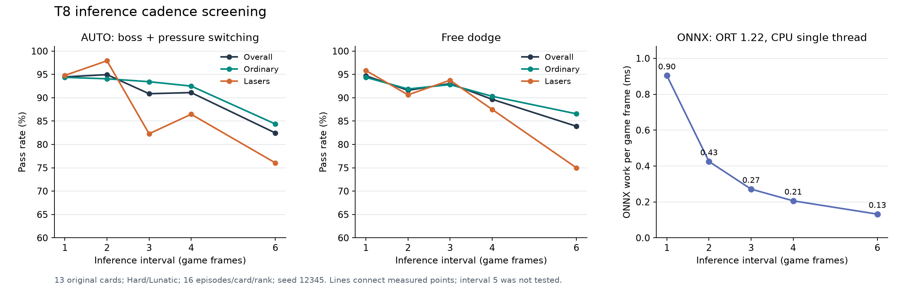

# T8部署推理间隔：1帧与2帧对照

2026-10-03：用户提出为节省部署性能试两帧一推理，确认按方案先做离线对照。此为部署诊断，不占用新训练T编号。

## 已确认语义

每2帧更新一次策略请求，中间帧保持上次**请求动作**；运动层、观测解码、意图／压力更新和游戏仍逐帧推进。不是直接保持最终按键，也不将env.frame_skip改成2。新局首帧立即推理，逐环境清除缓存；保持计数使用实际执行动作及真实帧数。

游戏侧将来实施时仍需逐帧更新敌人速度跟踪：当前共享C的差分要求frame连续，跳过填表会将下一次敌人速度置零。用户要求的8帧激光运动平滑保持逐帧更新。本次只写训练仓的诊断工具，不修改或打包游戏mod。

## 筛查协议

固定T8 graph6、K4、best=u3500；CPU贪心、seed12345、原13卡留出，rank2/3（Hard/Lunatic）每组16局，仅取首局。两种意图：boss_or_free_v1（进入16颗、半径96px、退出8颗且待满60帧）和follow_player_v1。各意图比较间隔1／2帧，共13×2×16×2×2=1664局；分批安排完全一致。保留原运动层hold=[2,6]、delay=[0,2]、slow=true，评测关闭训练判定放大。

指标：整体／普通／激光及逐卡／rank通过率，同环境索引的通过／死亡配对变化；生产评测的按键、变向和短段指标；额外保存逐帧请求／执行与推理标记，检验缓存语义、首局边界和推理数量。单评测seed、每格16局是筛查，细小率差不作稳定收益结论。

训练侧torch批量前向用于行为对照，不用其耗时外推部署。另取真实引擎观测填入现有640弹／256敌／64激光ONNX图，以包内同版本ORT1.22.0、CPU单线程、batch1做固定输入流基准；warmup后交替比较每帧／隔帧调用。记录模型调用时间／调用次数／每游戏帧摊销，C抽取／填表／hook和Windows实际游戏不在该基准里。

## 验证与边界

- 间隔1的记录与完全原生产评测逐局结果对齐；小规模间隔2检查跳过帧请求复用、运动层逐帧推进、新局缓存更新，首局唯一终止与帧数一致。
- 沿用相关已有测试，诊断不改生产PPO／CUDA图／引擎。产物保留checkpoint、ONNX、卡源、源码、逐局／轨迹及runtime SHA。
- 不重训，不自动实施动作持续时间学习，不执行之前记录的失败轨迹实验2，不提交／推送。

## 执行与结果

行为筛查已完成。小规模预检各8局（th06_s3_w12、th06_s4_b12的Hard/Lunatic，每格2局）：间隔1逐局记录与完全未修改的生产评测器一致；两臂均6/8撑过，无超时。首局推理次数精确等于steps／ceil(steps/2)，额外14／15个自动reset样本核验了新局立即推理和跳过帧请求保持。每步断言motor.t只推进一次。已有motor／evaluate／episodes测试35 passed（67.91秒）。只读独立审查无剩余阻塞。

预检命令模板（分别取interval=1、2，输出preflight-i1、preflight-i2）：

```bash
uv run --frozen python scripts/diag/inference_interval.py runs/job-28a4532abf792cc4/20261002-103401-t8-laser-k4/checkpoints/best.pt --out runs/20261003-t8-interval/preflight-i1 --cards th06_s3_w12 th06_s4_b12 --episodes 2 --interval 1 --preflight
uv run --frozen pytest -q tests/test_motor.py tests/test_evaluate.py tests/test_episodes.py
```

预检完成后仅追加reset的断言和来源SHA字段，独立核对已保存完整轨迹满足这些断言；正式采集使用追加后的同一版本脚本。

ORT基准在正式四臂启动前完成，避免本次评测负载干扰。使用预检采集的50份实际观测、640／256／64行图输入，实际ONNX与部署manifest SHA一致，ORT1.22.0 wheel与既有官方来源收据SHA一致。CPU单线程／ORT_SEQUENTIAL／ORT_ENABLE_ALL与共享C一致；固定输入流10轮，交替臂顺序与输入偏移0／1，平衡奇偶样本（预检样本按卡／rank交错），不只反复测偶数rank2样本。

```bash
uv run --frozen python scripts/diag/benchmark_interval_onnx.py --feeds runs/20261003-t8-interval/preflight-i1/feeds.npz --model dist/t8-laser-k4-best.onnx --runtime-wheel runs/t8-package-validation/ort122/onnxruntime-1.22.0-cp312-cp312-manylinux_2_27_x86_64.manylinux_2_28_x86_64.whl --out runs/20261003-t8-interval/onnx-benchmark.json
```

实测中位数：每游戏帧摊销0.8477→0.4092毫秒，ONNX调用部分减少51.72%。这不是整个mod或Windows游戏CPU减少51.72%；抽取／填表等仍需逐帧做，硬件与后台负载也有差异。基准不会模拟缓存动作的行为收益，行为由下面四臂单独评测。

正式四臂命令采用同一个模板，mode∈{deploy,free}、interval∈{1,2}，日志分别在对应输出目录旁边的.log：

```bash
uv run --frozen python scripts/diag/inference_interval.py runs/job-28a4532abf792cc4/20261002-103401-t8-laser-k4/checkpoints/best.pt --out runs/20261003-t8-interval/deploy-i1 --mode deploy --interval 1 --episodes 16 --threads 2
```

本机cgroup v1 user.slice为quota=-1，每臂torch／引擎2线程。四个实际Python进程已核验且均约200% CPU，有真实步进日志；启动时PID为2099548／2099717／2099547／2099551（deploy-i1／deploy-i2／free-i1／free-i2）。每臂5批、每批最多3卡，manifest记录状态和输入／源码／批次SHA。

间隔2按due子批量推理，新局重置可能改变同批其他首局环境的前向batch大小，近平局argmax会有浮点微差；不能把边缘的一两局变化全部归因于降低频率。单批预检的50份feeds完整保留；汇总另外保存诊断helper、feeds-meta和来源manifest SHA。

后续复算命令：

```bash
uv run --frozen python scripts/diag/summarize_inference_interval.py runs/20261003-t8-interval --out docs/practice-cards/reports/t8-inference-interval-summary.json
```

## 完整筛查结果（2026-10-03）

四臂各416局，全部完成，共1664局，无超时。部署图／权重／意图／运动层／seed／卡源保持配对一致；全部20批的逐局数量、首局唯一终止／帧数、间隔与复用、reset后立即推理及SHA已核验。详见[结果汇总与来源](reports/t8-inference-interval-summary.json)。

| 意图 | 范围 | 每帧 | 每2帧 | 变化 |
|---|---|---:|---:|---:|
| boss＋压力切自由 | 全13卡 | 393/416，94.47% | 395/416，94.95% | +0.48pp |
| 同上 | 普通10卡 | 302/320，94.38% | 301/320，94.06% | −0.31pp |
| 同上 | 激光3卡 | 91/96，94.79% | 94/96，97.92% | +3.13pp |
| 纯自由 | 全13卡 | 394/416，94.71% | 381/416，91.59% | −3.13pp |
| 同上 | 普通10卡 | 302/320，94.38% | 294/320，91.88% | −2.50pp |
| 同上 | 激光3卡 | 92/96，95.83% | 87/96，90.63% | −5.21pp |

相同card／rank／env索引配对：部署意图380局都通过、8局都死亡，2帧新增救活15局／新增死亡13局；纯自由365局都通过、6局都死亡，新增救活16局／新增死亡29局。总均值接近仍有具体案例涨跌，不声称部署意图逐局无损。

激光逐卡两档合并：

| 卡 | 部署意图，1→2帧 | 自由，1→2帧 |
|---|---:|---:|
| 露米娅th06_s1_b3 | 100→100% | 100→100% |
| 水符th06_s4_b12 | 93.75→93.75% | 100→87.50% |
| 竖柱th06_s4_w16 | 90.63→100% | 87.50→84.38% |

纯自由普通卡回退分布还包括th06_s3_w02、th06_s3_w12、th06_s3_b5、th06_s3_b7；也存在th06_s2_w08改善。每卡／rank只有16局，一局等于6.25pp，不根据单格涨跌宣布通用提升或绝对退化。

### 动作节奏与推理成本

| 首局Alive帧池化指标，1→2帧 | 部署意图 | 纯自由 |
|---|---:|---:|
| 原始请求变向／秒 | 4.35→3.75 | 2.69→2.29 |
| 实际执行变向／秒 | 2.99→2.96 | 1.83→1.80 |
| 请求A→B→A短往返／秒 | 0.92→0.49 | 0.61→0.34 |
| 实际执行短段≤2帧占比 | 5.02→4.32% | 4.46→3.94% |

降低推理频率减少了请求变化和短往返，实际执行的变向频率变化很小；它不是已经学会动作持续时间的证据。指标按首局Alive总秒数池化，与历史逐局平均／不同意图的实验1分开。首次动作选择不算变向，最后未结束段不计短段。

首局推理样本占比精确为1.0→0.50019（两组几乎一致，奇数局长末帧产生向上取整）。实际单实例ORT基准见上文：0.8477→0.4092 ms／游戏帧，推理调用部分约−51.72%，每轮600→300次调用。这里的约52%只属于ONNX工作；整个mod的比例取决于抽取／填表／日志等占比，仍需Windows实机验证。

四臂本机诊断耗时deploy 489.4→316.6秒、free 451.5→302.5秒。它们并行执行、动态批量不同，且终止轨迹不同，因此这些墙钟不用于推算单实例部署节省比例。

### 阶段判断

**两帧推理值得作为AUTO部署意图的可选省算档继续试用；当前纯自由／BYPASS保留逐帧更稳妥。** 本轮部署意图总体持平，纯自由存在观察到的成本，尤其水符与部分普通卡。结果只覆盖一个评测seed、单个训练seed的T8和每格16局，部署意图+0.48pp不作收益宣称，纯自由−3.13pp作为后续验证风险信号。

这里测试的是固定间隔2，不是“模型自己选择保持时长”。也未测试切换意图时强制推理、压力大时自适应频率或按AUTO／BYPASS使用不同间隔；这些需要另行确认方案，不把本轮结果自动推广到这些新处理。

本轮不修改／打包mod，不更换已经交付的T8包，不重训。此前实验2失败轨迹继续待执行。

## 最终验证与产物

- 正式四个进程退出码0、manifest均complete；相关测试35 passed，预检生产评测对齐、完整轨迹及reset检查通过。
- 复算脚本退出码0，全部NPZ／逐局JSON SHA和计数复算通过；四臂mode／interval／16局、批次布局、rank2/3、config／engine／torch／split／卡源／helper源均一致。benchmark→feeds→部署ONNX→训练checkpoint SHA链已绑定。
- 独立审查检出了固定偶数样本的基准偏差，正式基准已改为交替输入起点并保留记录；审查后的汇总额外补入局数／批次和模型来源断言，没有改变采集或指标。
- [采集脚本](../../scripts/diag/inference_interval.py)、[ONNX基准](../../scripts/diag/benchmark_interval_onnx.py)、[复算脚本](../../scripts/diag/summarize_inference_interval.py)；原始产物`runs/20261003-t8-interval/`遵守gitignore，JSON汇总可版本管理。
- 未验证Windows实际游戏帧耗时、真实游戏日志或新的游戏部署实现；未提交／推送。

## 继续消融：间隔3帧（2026-10-03，已完成）

用户随后明确要求继续看3帧效果。沿用已确认语义、T8 u3500、卡／rank／seed／意图／运动层／每格16局及3卡批次，新增deploy-i3与free-i3各416局，共832新局；历史1／2帧行为数据复用，不重新训练或修改mod。每3帧推理，另外两帧复用原始请求；所有环境／控制状态仍每帧推进。

采集器原本的age／缓存调度是通用正间隔，代码只改文档字符串和CLI choices。改前保存`runs/20261003-t8-interval/collector-before-i3.py`，其SHA `e4d556e800d11f310add50dd2d250c2922a48cf79a64d57cbfac5dd72fb4d08e`与全部历史1／2帧manifest一致。新汇总必须证明当前代码等于该归档的这两处替换，才能纳入不同script SHA的历史对照；其他config／源码／卡源／helper／batch要求保持一致。

3帧小规模预检：原两张弱项卡、两档、每格2局，共8局，5局撑过、3局死亡。逐帧缓存／推理节奏与首局边界及reset检查通过，相关已有测试35 passed（73.29秒）。预检只用于链路检查，不以5/8与旧6/8判断性能差异。

```bash
uv run --frozen python scripts/diag/inference_interval.py runs/job-28a4532abf792cc4/20261002-103401-t8-laser-k4/checkpoints/best.pt --out runs/20261003-t8-interval/preflight-i3 --cards th06_s3_w12 th06_s4_b12 --episodes 2 --interval 3 --preflight
```

ONNX性能基准在本次同轮比较1／2／3，旧基准保留；12轮循环／反转执行次序，使各间隔在每个次序位置出现4次，输入起点轮换0..5，平衡模2／3。固定50份样本×12＝600游戏帧／臂／轮，调用次数600／300／200；3帧还会在每轮均匀覆盖50份输入。正式基准在本次预检／测试完成后、完整行为评测启动前运行，避免本次评测负载。

```bash
uv run --frozen python scripts/diag/benchmark_interval_onnx.py --feeds runs/20261003-t8-interval/preflight-i1/feeds.npz --model dist/t8-laser-k4-best.onnx --runtime-wheel runs/t8-package-validation/ort122/onnxruntime-1.22.0-cp312-cp312-manylinux_2_27_x86_64.manylinux_2_28_x86_64.whl --intervals 1 2 3 --out runs/20261003-t8-interval/onnx-benchmark-i123.json
```

正式行为命令模板（mode分别deploy／free）：

```bash
uv run --frozen python scripts/diag/inference_interval.py runs/job-28a4532abf792cc4/20261002-103401-t8-laser-k4/checkpoints/best.pt --out runs/20261003-t8-interval/deploy-i3 --mode deploy --interval 3 --episodes 16 --threads 2
```

```bash
uv run --frozen python scripts/diag/summarize_inference_interval.py runs/20261003-t8-interval --intervals 1 2 3 --benchmark runs/20261003-t8-interval/onnx-benchmark-i123.json --out docs/practice-cards/reports/t8-inference-interval123-summary.json
```

独立只读审查确认3帧调度、基准的模3覆盖与执行顺序，以及历史控制代码的窄范围哈希归并正确。汇总追加“所选间隔必须存在于benchmark”的校验。保持单seed／每格16局、动态前向批量浮点微差及非Windows实机的边界。

正式三臂基准（完成预检／测试后、启动行为采集前）：1／2／3帧每游戏帧摊销0.7812／0.4112／0.2651 ms，2／3帧相对1帧的ONNX工作减少47.37%／66.07%，3帧相对2帧再减少35.54%。本次同轮数值优先用于三档成本比较，不混入旧基准的0.8477ms基线。初版基准在预检／测试负载下的结果另存`onnx-benchmark-i123-preflight-load.json`，不纳入正式报告。

新两臂实际Python进程2431411／2431412（deploy-i3／free-i3）在启动后核验：各约200% CPU且有逐帧推进日志。本机cgroup user.slice仍quota=-1，各torch／引擎2线程。独立完整preflight轨迹审查还核验了3210次首局推理＝每局ceil(steps/3)之和，以及14个reset边界。

### 3帧完整结果

新增两臂各416局、均完成且无超时，新增832局；与历史1／2帧合计2496局。新两臂实际退出码0，manifest complete。完整[1／2／3帧汇总](reports/t8-inference-interval123-summary.json)保留所有配对和来源；旧1／2帧汇总与原始数据完整保留。

| 意图／范围 | 1帧 | 2帧 | 3帧 | 3−1 | 3−2 |
|---|---:|---:|---:|---:|---:|
| AUTO口径总体 | 393/416，94.47% | 395/416，94.95% | 378/416，90.87% | −3.61pp | −4.09pp |
| AUTO普通 | 302/320，94.38% | 301/320，94.06% | 299/320，93.44% | −0.94pp | −0.63pp |
| AUTO激光 | 91/96，94.79% | 94/96，97.92% | 79/96，82.29% | −12.50pp | −15.63pp |
| 纯自由总体 | 394/416，94.71% | 381/416，91.59% | 387/416，93.03% | −1.68pp | +1.44pp |
| 纯自由普通 | 302/320，94.38% | 294/320，91.88% | 297/320，92.81% | −1.56pp | +0.94pp |
| 纯自由激光 | 92/96，95.83% | 87/96，90.63% | 90/96，93.75% | −2.08pp | +3.13pp |

AUTO的rank2总体96.15／97.60／95.67%，rank3总体92.79／92.31／86.06%，主要代价出现在Lunatic。逐张激光卡两档合并：

| 卡 | AUTO 1／2／3帧 | 自由 1／2／3帧 |
|---|---:|---:|
| 露米娅 | 100／100／93.75% | 100／100／100% |
| 水符 | 93.75／93.75／68.75% | 100／87.50／93.75% |
| 竖柱 | 90.63／100／84.38% | 87.50／84.38／87.50% |

3帧相对1帧的同索引配对：AUTO新增救活17局／新增死亡32局，净少通过15局；自由新增救活14局／新增死亡21局，净少7局。相对2帧：AUTO新增救活15／新增死亡32，净少17；自由新增救活22／新增死亡16，净多6。AUTO激光相对2帧新增死亡17／新增救活2，净少15/96局。因此退步不是只由一两局的总体均值波动描述出来的，但仍保留单seed／有限样本的证据边界。

### 动作节奏与成本比较

| 首局Alive帧池化指标 | AUTO 1／2／3帧 | 自由 1／2／3帧 |
|---|---:|---:|
| 请求变向／秒 | 4.35／3.75／3.41 | 2.69／2.29／2.00 |
| 实际变向／秒 | 2.99／2.96／3.08 | 1.83／1.80／1.80 |
| 请求短往返／秒 | 0.92／0.49／0.48 | 0.61／0.34／0.34 |
| 实际短段≤2帧占比 | 5.02／4.32／3.58% | 4.46／3.94／3.07% |

3帧的请求≤2帧短段占比为0，是固定缓存强制产生的性质，不能当作策略内生拟人节奏提升。实际方向变化没有显著降低；减少调用和请求频率不代表避让质量提升。3帧首局推理样本占比分别0.333522／0.333515，精确对应逐局ceil(steps/3)。

同轮单线程ORT基准：每游戏帧摊销1／2／3帧为0.7812／0.4112／0.2651 ms；3帧比2帧再省约0.1461 ms／帧（−35.54%），相对1帧ONNX工作约−66.07%。这是Linux上的图调用工作，不是整个mod或Windows实机CPU比例。各臂600／300／200次调用，输入和执行顺序覆盖均衡。

两条3帧行为诊断墙钟306.9／238.9秒（AUTO／free）。不同轮并行负载和轨迹不能用于训练或单实例部署成本归因。

### 更新的阶段建议

**现有模型优先保留AUTO可选2帧、自由1帧；不将3帧设为AUTO默认。** 本轮额外省算约0.15ms／游戏帧，AUTO却出现尤其明显的激光能力代价。自由3帧高于2帧、低于1帧，也说明间隔和能力不是简单单调关系；单次结果不足以宣布自由3帧通用优于2帧。

没有由结果自动启动重训、改变运动层参数、引入自适应间隔或修改mod。若将来专门按3帧训练，回答的是新的训练适应性问题，不应将本次现有模型部署消融的结果当作其上限。

### 本次最终核验

- 复算命令退出码0，6臂各416局且无超时；所有30批SHA、首局终止／帧数、缓存／cadence／reset、配对计数与控制指标重新核对通过。
- 新汇总在完整3帧采集前先复算旧1／2帧到临时文件，其全部summaries／cards／control_counts／control_rates／timing及配对计数与旧报告逐项完全相同；原报告未覆盖。
- 新旧采集器允许归并的修改限定为docstring和CLI choices，config、engine、torch、split、生产代码、卡源及helper仍逐项一致；新基准明确绑定旧50份feeds、实际ONNX和同一checkpoint。
- 相关已有测试35 passed，独立只读审查和完整预检审查通过。文档链接与空白检查通过；Windows实机未验证，未提交／推送。

## 继续消融：间隔4／6帧（2026-10-03，已完成）

用户明确要求继续4帧和6帧，观察现有策略何时退化。沿用相同T8、13卡Hard/Lunatic、每格16局、seed12345、AUTO与自由意图及运动层；新增deploy/free各i4、i6，共1664新局。历史1／2／3帧行为数据复用，合计最终将有4160局。中间3／5帧保留原始请求，所有环境、意图、观测及运动层仍逐帧推进。

只有collector文档首行和CLI choices扩为1／2／3／4／6。改前保存`collector-before-i46.py`，SHA `82c95f78e7036b9879f4b6014dc23c59d4c660a263939055d336d1e136b8bb5f`与历史3帧两份manifest一致；1／2帧归档继续保留。新汇总对每份历史归档仅替换首行和`--interval`参数行，要求其余源码与当前逐字一致，其他来源约束保持。

各8局预检完成：4帧8/8、6帧5/8撑过，只用于链路验证，不作能力结论。独立完整轨迹核验：4帧2792次首局推理＝sum ceil(steps/4)，15个reset；6帧1562次，16个reset。请求复用／新局立即推理／首局边界／逐帧运动层检查通过，相关已有测试35 passed（71.34秒）。

```bash
uv run --frozen python scripts/diag/inference_interval.py runs/job-28a4532abf792cc4/20261002-103401-t8-laser-k4/checkpoints/best.pt --out runs/20261003-t8-interval/preflight-i4 --cards th06_s3_w12 th06_s4_b12 --episodes 2 --interval 4 --preflight
uv run --frozen python scripts/diag/inference_interval.py runs/job-28a4532abf792cc4/20261002-103401-t8-laser-k4/checkpoints/best.pt --out runs/20261003-t8-interval/preflight-i6 --cards th06_s3_w12 th06_s4_b12 --episodes 2 --interval 6 --preflight
uv run --frozen pytest -q tests/test_motor.py tests/test_evaluate.py tests/test_episodes.py
```

本轮五档ORT基准在预检／测试后、正式行为任务前运行。帧数取50×lcm(12,1,2,3,4,6)=600；输入偏移数取lcm(gcd(50,i))=2，轮数2×lcm(5,2)=20。每档在五个执行位置各出现4次；每份输入在1／2／3／4／6帧分别使用240／120／80／60／40次，均等覆盖，旧基准文件不覆盖。

```bash
uv run --frozen python scripts/diag/benchmark_interval_onnx.py --feeds runs/20261003-t8-interval/preflight-i1/feeds.npz --model dist/t8-laser-k4-best.onnx --runtime-wheel runs/t8-package-validation/ort122/onnxruntime-1.22.0-cp312-cp312-manylinux_2_27_x86_64.manylinux_2_28_x86_64.whl --intervals 1 2 3 4 6 --out runs/20261003-t8-interval/onnx-benchmark-i12346.json
```

正式行为模板（mode分别deploy/free、interval分别4/6）：

```bash
uv run --frozen python scripts/diag/inference_interval.py runs/job-28a4532abf792cc4/20261002-103401-t8-laser-k4/checkpoints/best.pt --out runs/20261003-t8-interval/deploy-i4 --mode deploy --interval 4 --episodes 16 --threads 2
```

```bash
uv run --frozen python scripts/diag/summarize_inference_interval.py runs/20261003-t8-interval --intervals 1 2 3 4 6 --benchmark runs/20261003-t8-interval/onnx-benchmark-i12346.json --out docs/practice-cards/reports/t8-inference-interval12346-summary.json
```

目的为观察各意图／普通／激光的退化曲线，不人为拟合单一阈值，不假定单调。继续保留单seed／每格16局和动态前向批量浮点微差的边界。只读独立审查通过；不改mod、不训练、不执行此前实验2，不提交／推送。

五档正式基准完成：每游戏帧摊销1／2／3／4／6帧为0.9038／0.4252／0.2713／0.2060／0.1319 ms；4／6帧相对每帧推理部分减少77.21%／85.40%。输入偏移、每轮600／300／200／150／100次调用、每个执行位置4次都核验通过。本轮同轮数据用于成本比较，不混用之前批次的基线，也不声称整个mod／Windows游戏有同样比例。

正式四个Python进程在启动后已核验，每条约200% CPU且日志真实步进：PID2617587／2617586／2617585／2617588分别对应deploy-i4／deploy-i6／free-i4／free-i6。cgroup user.slice仍quota=-1，各torch／引擎2线程。新汇总先复算历史1／2／3到临时文件，全部卡／汇总／控制／计时指标和配对结果与旧报告逐项一致，旧结果未覆盖。

### 4／6帧完整结果与五档曲线

新增四臂各416局，共1664局，全部完成、无超时；10臂合计4160局。新进程全部退出码0，manifest complete。[五档汇总](reports/t8-inference-interval12346-summary.json)保留所有两两配对、来源及复算证据；历史报告与原始数据继续保留。



图的连线仅连接实际测点，不表示5帧或其他间隔已验证。各点是同一个训练seed模型／评测seed，不能当成独立训练重复。

| 通过率范围 | 1帧 | 2帧 | 3帧 | 4帧 | 6帧 |
|---|---:|---:|---:|---:|---:|
| AUTO总体 | 94.47% | 94.95% | 90.87% | 91.11% | 82.45% |
| AUTO普通 | 94.38% | 94.06% | 93.44% | 92.50% | 84.38% |
| AUTO激光 | 94.79% | 97.92% | 82.29% | 86.46% | 76.04% |
| 纯自由总体 | 94.71% | 91.59% | 93.03% | 89.66% | 83.89% |
| 纯自由普通 | 94.38% | 91.88% | 92.81% | 90.31% | 86.56% |
| 纯自由激光 | 95.83% | 90.63% | 93.75% | 87.50% | 75.00% |

新四臂的准确分子／分母：AUTO4总体379/416、普通296/320、激光83/96；AUTO6为343/416、270/320、73/96。自由4为373/416、289/320、84/96；自由6为349/416、277/320、72/96。

| 新档相对1帧 | AUTO总体／普通／激光变化 | 自由总体／普通／激光变化 |
|---|---:|---:|
| 4帧 | −3.37／−1.88／−8.33pp | −5.05／−4.06／−8.33pp |
| 6帧 | −12.02／−10.00／−18.75pp | −10.82／−7.81／−20.83pp |

6帧不仅激光下降，普通卡也明显受损。Lunatic总体从AUTO每帧92.79%降到6帧73.56%，自由92.79→75.00%；Hard分别96.15→91.35%、96.63→92.79%。因此6帧的代价在更难的场景尤其明显。

激光逐卡两档合并：

| 卡 | AUTO 1／2／3／4／6帧 | 自由 1／2／3／4／6帧 |
|---|---:|---:|
| 露米娅 | 100／100／93.75／87.50／96.88% | 100／100／100／96.88／96.88% |
| 水符 | 93.75／93.75／68.75／81.25／56.25% | 100／87.50／93.75／78.13／56.25% |
| 竖柱 | 90.63／100／84.38／90.63／75.00% | 87.50／84.38／87.50／87.50／71.88% |

波动说明退化不是逐卡单调。AUTO4激光比3帧有所回升，仍低于1／2；露米娅6帧也高于4帧，不能据此掩盖6帧的总体代价。

相同card／rank／env配对的新增通过／新增死亡：

| 比较 | AUTO救活／死亡／净变化 | 自由救活／死亡／净变化 |
|---|---:|---:|
| 1→4帧 | 18／32／−14局 | 11／32／−21局 |
| 1→6帧 | 12／62／−50局 | 8／53／−45局 |
| 2→4帧 | 14／30／−16局 | 24／32／−8局 |
| 2→6帧 | 8／60／−52局 | 19／51／−32局 |

### 动作节奏和省算

| 首局Alive帧池化指标 | AUTO 1／2／3／4／6帧 | 自由 1／2／3／4／6帧 |
|---|---:|---:|
| 原始请求变向／秒 | 4.35／3.75／3.41／2.98／2.47 | 2.69／2.29／2.00／1.76／1.45 |
| 实际变向／秒 | 2.99／2.96／3.08／2.91／2.48 | 1.83／1.80／1.80／1.72／1.45 |
| 实际短段≤2帧占比 | 5.02／4.32／3.58／2.05／0.77% | 4.46／3.94／3.07／1.67／0.34% |

4／6帧请求短段≤2帧和请求≤3帧的A→B→A短往返都为0，是缓存机制强制的结果，不代表模型内生策略已拟人化；实际移动段6帧的≤2帧占比也是0，伴随的是通过率退步。首次动作选择不算变向，最后未结束段不计。

首局推理占比4帧约0.25028、6帧约0.16694，精确等于逐局ceil(steps/K)／总步数。ONNX同轮每游戏帧摊销0.9038／0.4252／0.2713／0.2060／0.1319 ms，对应4／6帧约−77.21%／−85.40%的图调用工作；从2→4再省约0.219ms／游戏帧，2→6约0.293ms。不是整个mod或实际Windows游戏的节省比例。

新四臂本地行为诊断用时282.2／237.1／244.2／200.8秒（AUTO4／AUTO6／free4／free6）；并行负载、动态batch和失败轨迹不同，不用墙钟作单实例性能归因。

### 当前能回答的退化边界

- **AUTO激光**：本轮3帧已出现明显下降，4帧依然有代价，6帧进一步受损。2帧是当前筛查里最合适的省算候选。
- **AUTO普通弹幕**：3／4帧为较小下降，6帧总体下降10pp；容忍度高于这组激光。
- **纯自由**：2／3帧有波动且均低于1帧，4帧总体少约5pp、6帧少约11pp。保留每帧推理更稳妥。
- **整个策略没有统一、单调的“第N帧必退化”阈值**。当前测到的是现有checkpoint直接降低部署频率的表现；5帧未测，只有单训练seed／单评测seed，每卡rank16局。若要确认精确默认间隔，应补评测seed，而不是把本轮折线拟合为通用定律。

在60Hz下，间隔4／6分别是15／10Hz决策；相对逐帧，当前观测变化最多多等待3／5帧（约50／83ms）才影响新请求。这解释了需要关注反应时机，但本轮未做死亡轨迹或真实引擎分叉，不能宣称所有新死亡都由晚反应导致。

### 本轮完成验证

- 35项相关已有测试通过，独立审查核对了预检全轨迹、来源归档、基准覆盖和新汇总。正式四臂逐步检查了请求复用／motor每帧推进，全部首局终止／帧数及reset检查通过。
- 五档10臂复算退出码0，所有50批NPZ／逐局JSON SHA和控制计数通过；两两配对计数闭合，历史1／2／3数字与之前报告逐项相同。来源模型／卡／rank／seed／reward／motor／生产代码仍一致。
- [绘图脚本](../../scripts/diag/plot_inference_interval.py)直接读取五档报告；PNG嵌入报告SHA，已查看并核对点、标签、单位和5帧未测说明。相关文档链接与空白检查通过。
- 本轮未修改mod／训练或验证Windows实机，未提交／推送。此前实验2仍待执行。

## 后续待执行：两帧训练

用户随后提出按两帧一次决策训练，以提高相同wall clock的真实环境暴露并匹配部署节奏，要求只记录、之后再进行。[候选实验](2026-10-03-two-frame-training-candidate.md)已记录回报／折扣／PPO样本、运动层逐帧、预算和比较口径；成本估算约1.45倍不是实测。本次不实施或开跑。
